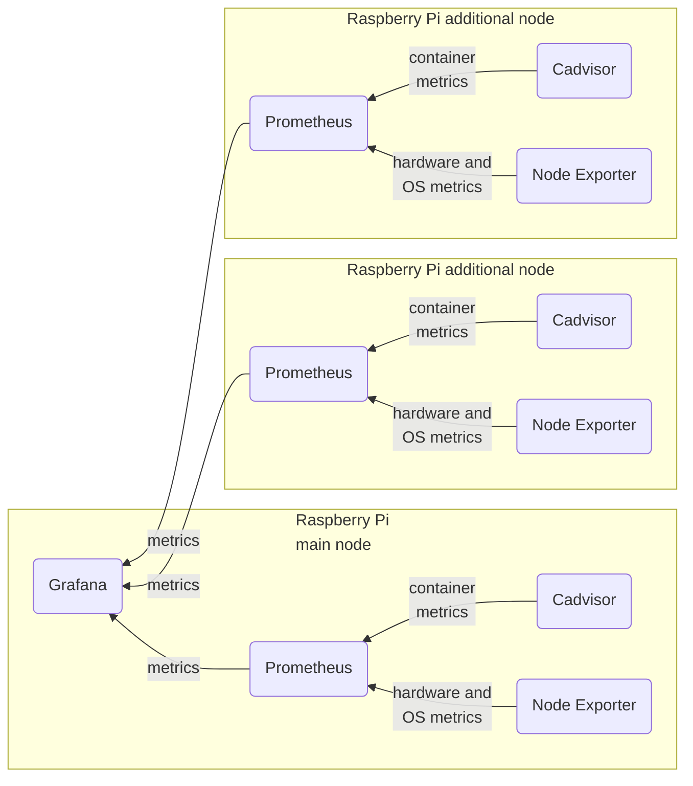

## Raspberry Pi Servers Monitoring

How to install and configure Grafana, Prometheus, Cadvisor and Node Exporter for monitoring Raspberry Pis with Ubuntu OS,
and all of that will be running in Docker containers.

> These instructions are tested on Raspberry Pi 4B 4GB and 8GB. OS type: Ubuntu 20.04 and 22.04.
{: .prompt-info }

Here is the diagram of the final result:



### Prerequisites

In order to install all the necessary apps on a Raspberry Pi I am going to utilize Docker and Portainer, which means Docker, Compose and Portainer have to be installed on your Pi server.

To make all Grafana panels work as intended we need to enable `c-groups` by modifying `cmdline.txt` configuration file.
Execute the following command to open the file in the `nano` text editor:

```shell
sudo nano /boot/firmware/cmdline.txt
```
{: .nolineno }

Next, add the following to the beginning of the file:

```text
cgroup_enable=memory cgroup_memory=1
```
{: .nolineno }

Now save the file and reboot the machine.

```sh
sudo reboot
```
{: .nolineno }

When system will boot, execute the following command to verify the result:

```shell
cat /proc/cgroups
```
{: .nolineno }

The command that is specified above, should yield to a screen the information similar on the following screenshot:


_/proc/cgroups_


Now we need to create a couple of directories. Execute the following script to create the necessary folder structure:

```shell
#!/bin/bash

function error {
  echo -e "\\e[91m$1\\e[39m"
  exit 1
}

function check_internet() {
  printf "Checking if you are online..."
  wget -q --spider http://github.com
  if [ $? -eq 0 ]; then
    echo "Online. Continuing."
  else
    error "Offline. Go connect to the internet then run the script again."
  fi
}

check_internet

echo "Creating directories..."
sudo mkdir -p /portainer/Files/AppData/Config/prometheus/config || error "Failed to create config directory!"
sudo mkdir -p /portainer/Files/AppData/Config/prometheus/data || error "Failed to create data directory for Prometheus!"
sudo mkdir -p /portainer/Files/AppData/Config/grafana/data || error "Failed to create data directory for Grafana!"
echo "Download Prometheus config files if they don't exist"
if [ -d /portainer/Files/AppData/Config/prometheus/config/prometheus.yml ];
then
    echo "/portainer/Files/AppData/Config/prometheus/config/prometheus.yml is a directory removing"
    rm -rf '/portainer/Files/AppData/Config/prometheus/config/prometheus.yml/'
fi

if [ ! -f /portainer/Files/AppData/Config/prometheus/config/prometheus.yml ];
then
        sudo wget -O /portainer/Files/AppData/Config/prometheus/config/prometheus.yml https://raw.githubusercontent.com/oijkn/Docker-Raspberry-PI-Monitoring/main/prometheus/prometheus.yml || error "Failed to download prometheus.yml file!"
fi

if [ -d /portainer/Files/AppData/Config/grafana/grafana.ini ];
then
    echo "/portainer/Files/AppData/Config/grafana/grafana.ini is a directory removing"
    rm -rf '/portainer/Files/AppData/Config/grafana/grafana.ini'
fi
sudo touch /portainer/Files/AppData/Config/grafana/grafana.ini || error "Failed to touch grafana.ini file!"
echo "Setting up the permissions..."
sudo chown -R 472:472 /portainer/Files/AppData/Config/grafana/data || error "Failed to set permissions for Grafana data!"
echo "Done"

```
The bash script that is specified above will create the necessary directory structure for **_Prometheus_** and **_Grafana_**.

## Installation

In order to deploy all the necessary Docker containers I am going to utilize [Portainer](https://www.portainer.io/).
Go to `Stacks` section and click on `Add stack`. Then give a name to your stack and paste the following:

```yaml

# Containers
services:
  # Container
  cadvisor:
    image: zcube/cadvisor:latest
    container_name: cadvisor
    restart: always
    ipc: shareable
    privileged: true
#    ports:
#      - "8080:8080"
    command:
      - '--docker_only=true'
      - '--housekeeping_interval=30s'
      - '--disable_metrics=accelerator,cpu_topology,disk,memory_numa,tcp,udp,percpu,sched,process,hugetlb,referenced_memory,resctrl,cpuset,advtcp,memory_numa'
      - '--store_container_labels=false'
      - '--event_storage_event_limit=default=0'
      - '--event_storage_age_limit=default=0'
    volumes:
      - /:/rootfs:ro
      - /var/run:/var/run:rw
      - /sys:/sys:ro
      - /var/lib/docker/:/var/lib/docker:ro
      - /dev/disk/:/dev/disk:ro
      - /etc/machine-id:/etc/machine-id:ro
    networks:
      - monitor_net

  # Container
  node-exporter:
    image: prom/node-exporter:latest
    container_name: node_exporter
    restart: always
    user: "root:root"
    pid: host
#    ports:
#      - "9100:9100"
    volumes:
      - /proc:/host/proc:ro
      - /sys:/host/sys:ro
      - /:/rootfs:ro
    command:
      - '--path.procfs=/host/proc'
      - '--path.sysfs=/host/sys'
      - '--collector.filesystem.ignored-mount-points'
      - "^/(sys|proc|dev|host|etc|rootfs/var/lib/docker/containers|rootfs/var/lib/docker/overlay2|rootfs/run/docker/netns|rootfs/var/lib/docker/aufs)($$|/)"
    networks:
      - monitor_net

  # Container
  prometheus:
    image: prom/prometheus:latest
    container_name: prometheus
    restart: always
    user: "root:root"
    ports:
      - "9090:9090"
    depends_on:
      - cadvisor
      - node-exporter
    volumes:
      - /portainer/Files/AppData/Config/prometheus/data:/prometheus
      - /portainer/Files/AppData/Config/prometheus/config:/etc/prometheus/
    command:
      - '--config.file=/etc/prometheus/prometheus.yml'
      - '--storage.tsdb.path=/prometheus'
      - '--storage.tsdb.retention.time=${PROMETHEUS_RETENTION:-15d}'
      - '--web.console.libraries=/usr/share/prometheus/console_libraries'
      - '--web.console.templates=/usr/share/prometheus/consoles'
    networks:
      - monitor_net

  # Container
  grafana:
    image: grafana/grafana:main
    container_name: grafana
    restart: always
    user: "root:root"
    ports:
      - "3000:3000"
    environment:
      GF_SECURITY_ADMIN_USER: admin
      GF_SECURITY_ADMIN_PASSWORD: password
      GF_USERS_ALLOW_SIGN_UP: "false"
      GF_PATHS_CONFIG: /etc/grafana/grafana.ini
      GF_PATHS_DATA: /var/lib/grafana
      GF_PATHS_HOME: /usr/share/grafana
      GF_PATHS_LOGS: /var/log/grafana
      GF_PATHS_PLUGINS: /var/lib/grafana/plugins
      GF_PATHS_PROVISIONING: /etc/grafana/provisioning
    depends_on:
      - prometheus
    volumes:
      - /portainer/Files/AppData/Config/grafana/data:/var/lib/grafana
      - /portainer/Files/AppData/Config/grafana/grafana.ini:/etc/grafana/grafana.ini
      - /portainer/Files/AppData/Config/grafana/provisioning:/etc/grafana/provisioning
    networks:
      - monitor_net

networks:
  monitor_net:

```

> Work in progress
{: .prompt-info }
